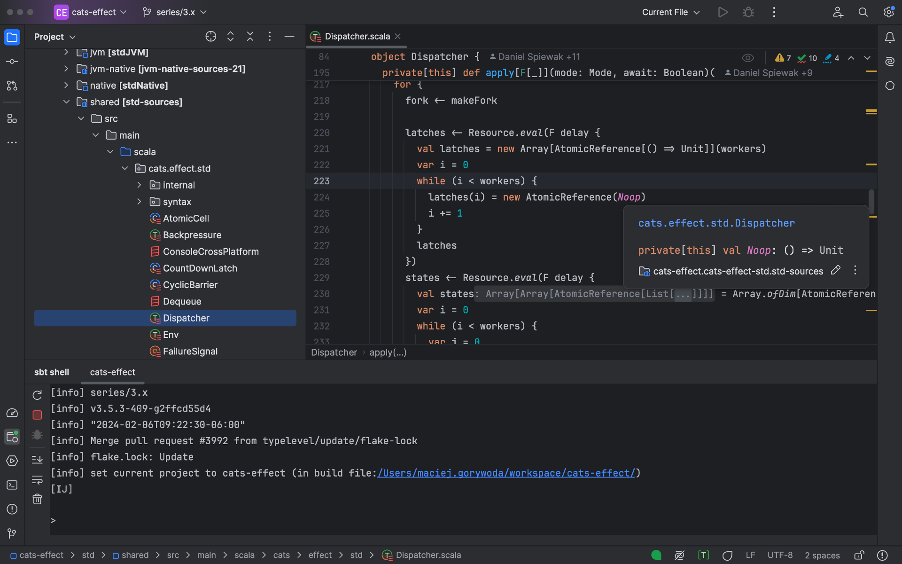
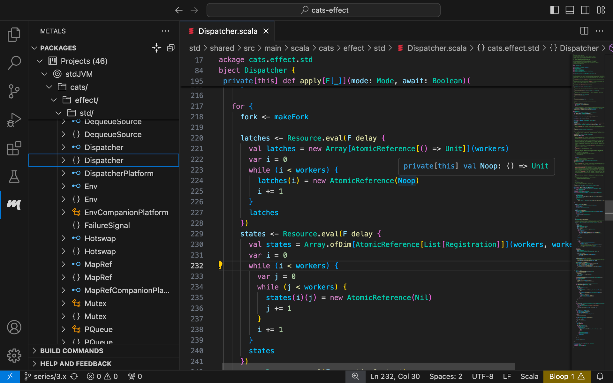

It's of course possible to write Scala code in any editor and compile and run the code from the command line. But most developers prefer to use an IDE (Integrated Development Environment), especially for coding anything beyond simple exercises.

The following IDEs are available for Scala:

## IntelliJ IDEA + Scala plugin

[https://jetbrains.com/scala](https://jetbrains.com/scala)

IntelliJ IDEA is a cross-platform IDE developed by JetBrains that provides a consistent experience for a wide range of programming languages and technologies. It also supports Scala through the IntelliJ Scala Plugin, which is being developed at JetBrains. First, install IntelliJ IDEA Community Edition (unless you don't already use the Ultimate edition) and then add the IntelliJ Scala Plugin.

IntelliJ IDEA and Scala Plugin will assist you in virtually every part of a Scala software developer's work. Use it if you like a solid integrated experience, sane default settings, and tested solutions.

For more information, check out our tutorial [Getting Started with Scala in IntelliJ](/getting-started/intellij-track/building-a-scala-project-with-intellij-and-sbt.html)

## Visual Studio Code + Metals

[https://scalameta.org/metals](https://scalameta.org/metals)

Visual Studio Code, commonly called VS Code, is a source code editor from Microsoft. To add Scala support, you install an extension called Metals.

(Why "Metals"? Because the underlying technologies are Scalameta and LSP ([Language Server Protocol](https://microsoft.github.io/language-server-protocol/)), and "Meta" + "LS" equals "Metals".)

In contrast to IntelliJ IDEA + Scala Plugin, VS Code + Metals is aimed at people who like to get feedback and code intelligence straight from the compiler, which enables them to also try out experimental Scala features.

## Your favorite editor + Metals

Metals is most commonly used with VS Code, but it's also available for the following popular editors:

* Emacs
* Vim
* Sublime Text
* Helix

as documented [here](https://scalameta.org/metals/docs/#editor-support).
