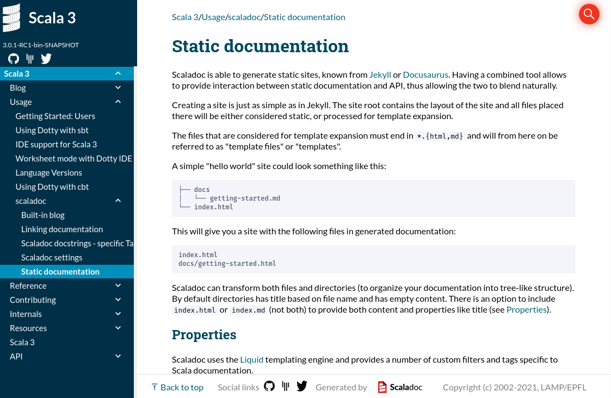
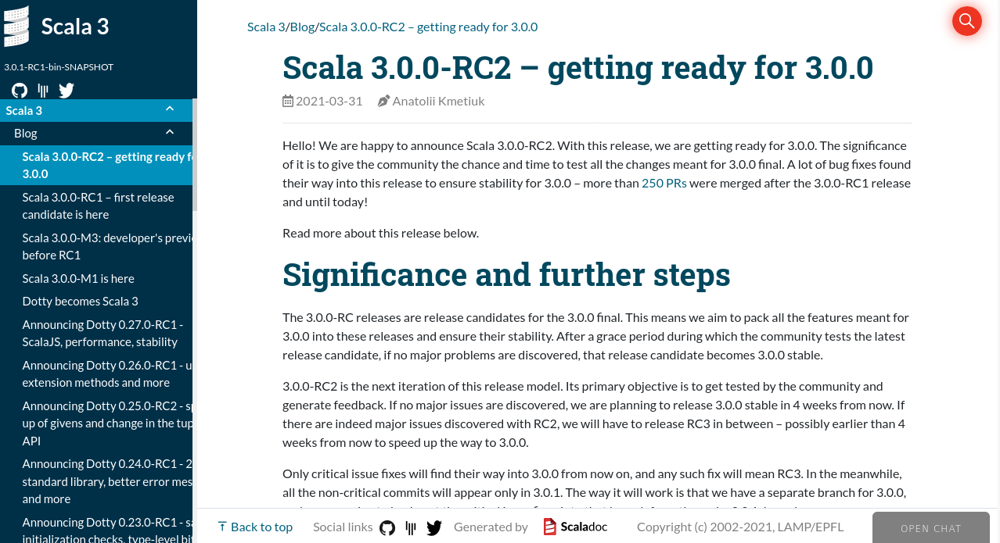

Новая версия Scala 3 поставляется со совершенно новой реализацией генератора документации _Scaladoc_, переписанной с нуля. 
В этой статье вы можете найти основные сведения о новых функциях, которые уже есть или будут представлены в Scaladoc. 
Для общей справки см. руководство по [Scaladoc][scaladoc].

## Новая функциональность

### Markdown синтаксис

Самым большим изменением, представленным в новой версии Scaladoc, является изменение языка по умолчанию для строк документации. 
До сих пор Scaladoc поддерживал только синтаксис Wikidoc. 
Новый Scaladoc по-прежнему может анализировать устаревший синтаксис `Wikidoc`, 
однако Markdown был выбран в качестве основного языка для форматирования комментариев. 
Чтобы переключиться обратно на `Wikidoc`, можно передать глобальный параметр перед запуском задачи `doc` 
или определить его для конкретных комментариев с помощью директивы `@syntax wiki`.

Для получения дополнительной информации о том, как использовать все возможности документации, 
ознакомьтесь с [документацией Scaladoc][scaladoc-docstrings].

### Статический сайт

Scaladoc также предоставляет простой способ создания **статических сайтов** как для документации, 
так и для сообщений в блогах, подобно тому, как это делает Jekyll. 
Благодаря этой функциональности вы можете очень удобно хранить свою документацию вместе со сгенерированным Scaladoc API.

Для получения дополнительной информации о том, как настроить создание статических сайтов, 
ознакомьтесь с главой [Статическая документация][static-documentation].



### Посты в блоге

Посты в блогах — это особый тип статических сайтов. В руководстве по работе со Scaladoc 
вы можете найти дополнительную информацию о том, как работать с [сообщениями в блогах][built-in-blog].



### Ссылки на соцсети

Кроме того, Scaladoc предоставляет простой способ настроить [ссылки на социальные сети][social-links], например Twitter или Discord.

{: style="width: 180px"}

## Экспериментальные функции

Следующие функции в настоящее время (май 2021 г.) не являются стабильными для выпуска в scaladoc, 
однако мы рады услышать ваши отзывы. 
У каждой функции есть отдельная ветка на сайте авторов scala-lang, где вы можете поделиться своим мнением.

### Компиляция фрагментов

Одной из экспериментальных возможностей Scaladoc является компилятор фрагментов кода. 
Этот инструмент позволит вам компилировать фрагменты, которые вы прикрепляете к своей строке документации, 
чтобы проверить, действительно ли они ведут себя так, как предполагалось, например, правильно ли компилируются. 
Эта функция очень похожа на инструменты `tut` или `mdoc`, но будет поставляться вместе со Scaladoc, 
что упрощает настройку и интеграцию в ваш проект. 
Создание интерактивных фрагментов — например, предоставление пользователям возможности редактировать 
и компилировать их в браузере — находится на рассмотрении. Но в настоящее время эта функция пока не рассматривается.

Демонстрация:
* Скрытие кода 
* Проверка ошибок компиляции 
* Включение фрагментов 

Для получения дополнительной информации см. [Руководства][snippet-compiler] 
или следите за этой веткой [Scala Contributors](https://contributors.scala-lang.org/t/snippet-validation-in-scaladoc-for-scala-3/4976).

### Поиск по типу

Поиск функций по их символическим именам может занять много времени. 
Вот почему новый scaladoc позволяет искать методы и поля по их типам.

Итак, для объявления:

```
extension [T](arr: IArray[T]) def span(p: T => Boolean): (IArray[T], IArray[T]) = ...
```

Вместо поиска по `span` мы также можем искать по `IArray[A] => (A => Boolean) => (IArray[A], IArray[A])`.

Чтобы использовать эту функциональность, просто введите сигнатуру функции, которую ищете, в строке поиска scaladoc. 
Вот как это работает:


Эта функция предоставляется поисковой системой [Inkuire](https://github.com/VirtusLab/Inkuire), которая работает для Scala 3 и Kotlin. 
Чтобы быть в курсе развития этой функции, следите за репозиторием [Inkuire](https://github.com/VirtusLab/Inkuire).

Для получения дополнительной информации см. [соответствующую главу][search-engine]

Обратите внимание, что эта функция все еще находится в разработке, поэтому в нее могут быть внесены значительные изменения. 
Если вы столкнулись с ошибкой или у вас есть идея для улучшения, не стесняйтесь создавать issue на
[Inkuire](https://github.com/VirtusLab/Inkuire/issues/new) или [dotty](https://github.com/scala/scala3/issues/new).

[scaladoc]: /ru/scala3/guides/scaladoc/index.html
[scaladoc-docstrings]: /ru/scala3/guides/scaladoc/docstrings.html
[static-documentation]: /ru/scala3/guides/scaladoc/static-site.html
[built-in-blog]: /ru/scala3/guides/scaladoc/blog.html
[social-links]: /ru/scala3/guides/scaladoc/settings.html#-social-links
[search-engine]: /ru/scala3/guides/scaladoc/search-engine.html
[snippet-compiler]: /ru/scala3/guides/scaladoc/snippet-compiler.html
