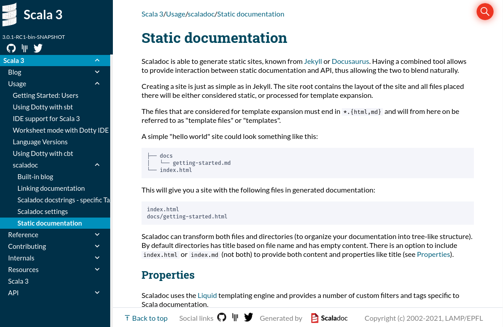

The new Scala version 3 comes with a completely new implementation of the documentation generator _Scaladoc_, rewritten from scratch. 
In this article you can find highlights of new features that are or will be introduced to Scaladoc.
For general reference, visit [Scaladoc manual](https://dotty.epfl.ch/docs/usage/scaladoc/)

# New features

## Markdown syntax

The biggest change introduced in the new version of Scaladoc is the change of the default language for docstrings. So far Scaladoc only supported Wikidoc syntax.
The new Scaladoc can still parse legacy `Wikidoc` syntax, however Markdown has been chosen as a primary language for formatting comments.
To switch back to `Wikidoc` one can pass a global flag before running the `doc` task or one can define it for specific comments via the `@syntax wiki` directive.

For more information on how to use the full power of docstings, check out [Scaladoc docstrings][scaladoc-docstrings]

## Static site

Scaladoc also provides an easy way for creating **static sites** for both documentation and blog posts in the similar way as Jekyll does.
Thanks to this feature, you can store your documentation along-side with the generated Scaladoc API in a very convenient way.

For more information on how to configure the generation of static sites check out [Static documentation][static-documentation] chapter

## Blog posts

Blog posts are a specific type of static sites. In the Scaladoc manual you can find additional information about how to work with [blog posts][built-in-blog].

## Social links

Furthermore, Scaladoc provides an easy way to configure your [social media links][social-links] e.g. Twitter or Gitter.

{: style="width: 180px"}

# Experimental features

The following features are currently (May 2021) not stable to be released with scaladoc, however we are happy to hear your feedback. Each feature has its own thread at scala-lang contributors site, where you can share your opinions.

## Snippets compiler

One of the experimental features of Scaladoc will be a snippets compiler. This tool will allow you to compile snippets that you attach to your docstring  
to check that they actually behave as intended, e. g. compile or throw some exception. The feature is very similar to `tut` or `mdoc` tools, 
but will be shipped with Scaladoc out of the box for easy setup and integration into your project. Making snippets interactive, e. g. user could edit them and compile in the browser is under consideration, though it is not in scope yet.

For more information you can follow this [thread](https://contributors.scala-lang.org/t/snippet-validation-in-scaladoc-for-scala-3/4976)

## Type-signature browsing

Haskell programmers are probably familiar with Hoogle - a documentation search engine that allows you browse the docs by signatures rather than symbolic names. Since many Scala developers are also functional programming fans, we decided to add a similar functionality to Scaladoc. The whole tool is based on [Inkuire](https://github.com/VirtusLab/Inkuire), which works with Kotlin and is being currently adapted to Scala 3.  

To be up-to-date with this feature you can follow this [thread](https://contributors.scala-lang.org/t/pre-sip-scaladoc-search-by-type-signature/1604/15).
Note that this feature is in an early stage of development. We still don't support type lambdas, higher-kinded types, and some other Scala features.

[scaladoc-docstrings]: https://dotty.epfl.ch/docs/usage/scaladoc/scaladocDocstrings.html
[static-documentation]: https://dotty.epfl.ch/docs/usage/scaladoc/staticSite.html
[built-in-blog]: https://dotty.epfl.ch/docs/usage/scaladoc/blog.html
[social-links]: https://dotty.epfl.ch/docs/usage/scaladoc/settings.html#-social-links
